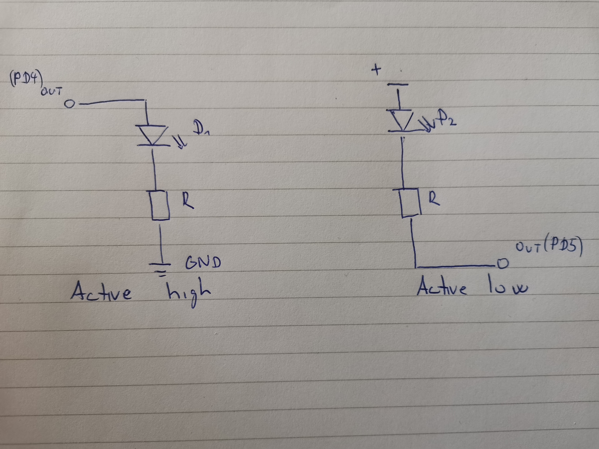
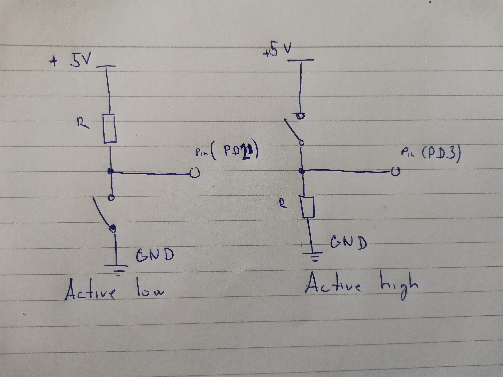

## Preparation tasks (done before the lab at home)

Draw two basic ways to connect a LED to the output pin of the microcontroller: LED active-low, LED active-high. What is the name of the LED pin that is connected to the microcontroller in each case? 
Digital pins on arduino UNO are called PD + number of pin
Draw two basic ways to connect a LED to the output pin of the microcontroller: LED active-low, LED active-high. What is the name of the LED pin that is connected to the microcontroller in each case?

&nbsp;

&nbsp;

&nbsp;

&nbsp;

&nbsp;

&nbsp;

| **LED color** | **Supply voltage** | **LED current** | **LED voltage** | **Resistor value** |
| :-: | :-: | :-: | :-: | :-: |
| red | 5&nbsp;V | 20&nbsp;mA | 2&nbsp;V | 350(360)&nbsp;Ohm|
| blue | 5&nbsp;V | 20&nbsp;mA | 4&nbsp;V | 50(51)&nbsp;Ohm|

Draw the basic ways to connect a push button to the microcontroller input pin: button active-low, button active-high.

&nbsp;

&nbsp;

&nbsp;
## Part 2: Active-low and active-high LEDs

AVR microcontroller associates pins into so-called ports, which are marked with the letters A, B, C, etc. Each of the pins is controlled separately and can function as an input (entry) or output (exit) point of the microcontroller. Control is possible exclusively by software via control registers.

There are exactly three control registers for each port: DDR, PORT and PIN, supplemented by the letter designation of the port. For port A these are registers DDRA, PORTA and PINA, for port B registers DDRB, PORTB, PINB, etc.

DDR (Data Direction Register) is used to set the input/output direction of port communication, PORT is the output data port and PIN works for reading input values from the port.

A detailed description of working with input/output ports can be found in [ATmega328P datasheet](https://www.microchip.com/wwwproducts/en/ATmega328p) in section I/O-Ports.

Use the datasheet to find out the meaning of the DDRB and PORTB control register values and their combinations.

| **DDRB** | **Description** |
| :-: | :-- |
| 0 | Input pin |
| 1 | Output pin |

| **PORTB** | **Description** |
| :-: | :-- |
| 0 | Output low value |
| 1 | Output high value |

| **DDRB** | **PORTB** | **Direction** | **Internal pull-up resistor** | **Description** |
| :-: | :-: | :-: | :-: | :-- |
| 0 | 0 | input | no | Tri-state, high-impedance |
| 0 | 1 | input | yes | Pxn will source current if ext. pulled low |
| 1 | 0 | output | no | Output low |
| 1 | 1 | output | no | Output high |

See [schematic of Arduino Uno board](../../Docs/arduino_shield.pdf) in docs folder of Digital-electronics-2 repository and find out which pins of ATmega328P can be used as input/output pins. To which pin is the LED L connected? Is it connected as active-low or active-high?

| **Port** | **Pin** | **Input/output usage?** |
| :-: | :-: | :-- |
| A | x | Microcontroller ATmega328P does not contain port A |
| B | 0 | Yes (Arduino pin 8) |
|   | 1 | Yes (Arduino pin -9) |
|   | 2 | Yes (Arduino pin -10) |
|   | 3 | Yes (Arduino pin -11) |
|   | 4 | Yes (Arduino pin 12) |
|   | 5 | Yes (Arduino pin 13) |
|   | 6 | No  (Arduino pin 13) |
|   | 7 | No  (Arduino pin 13) |
| C | 0 | Yes (Arduino pin A0) |
|   | 1 | Yes (Arduino pin A1) |
|   | 2 | Yes (Arduino pin A2) |
|   | 3 | Yes (Arduino pin A3) |
|   | 4 | Yes (Arduino pin A4) |
|   | 5 | Yes (Arduino pin A5) |
|   | 6 | Doesnt have |
|   | 7 | Doesnt have |
| D | 0 | Yes (Arduino pin RX<-0) |
|   | 1 | Yes (Arduino pin TX->1) |
|   | 2 | Yes (Arduino pin 2) |
|   | 3 | Yes (Arduino pin -3) |
|   | 4 | Yes (Arduino pin 4) |
|   | 5 | Yes (Arduino pin -5) |
|   | 6 | Yes (Arduino pin -6) |
|   | 7 | Yes (Arduino pin 7) |

Use breadboard (or SimulIDE real time electronic circuit simulator), connect resistor and second LED to Arduino output pin in active-low way. **Let the second LED is connected to port C.**

&nbsp;

&nbsp;

&nbsp;
