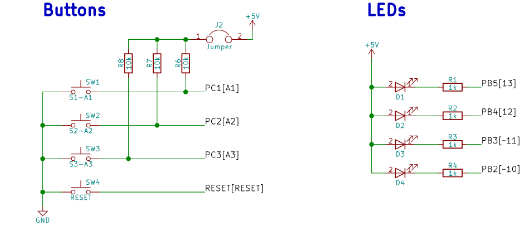

| **Module** | **Number of bits** | **1** | **8** | **32** | **64** | **128** | **256** | **1024** |
| :-: | :-: | :-: | :-: | :-: | :-: | :-: | :-: | :-: |
| Timer/Counter0 | 8  | 16u | 128u | -- |1024u | -- | 4096u| 16384u |
| Timer/Counter1 | 16 |  4096u |  32768u | -- |262144u| -- |1048576u |4194304u|
| Timer/Counter2 | 8  | 16u | 128u | 512u |1024u | 2048u | 4096u| 16384u |

Shields are boards that can be attached to an Arduino board, significantly expand its capabilities, and makes prototyping much faster. See schematic of [Multi-function shield](../../Docs/arduino_shield.pdf) and find out the connection of four LEDs (D1, D2, D3, D4) and three push buttons (S1-A1, S2-A2, S3-A3).

&nbsp;

&nbsp;

&nbsp;

&nbsp;

&nbsp;

&nbsp;
