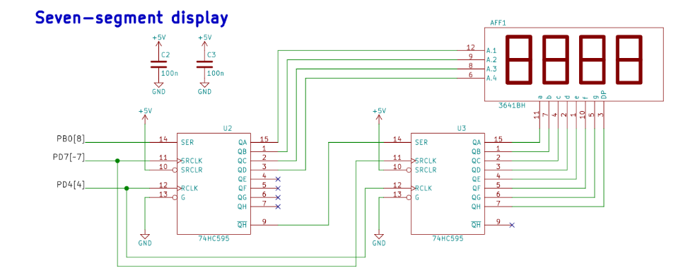

| **Module** | **Number of bits** | **1** | **8** | **32** | **64** | **128** | **256** | **1024** |
| :-: | :-: | :-: | :-: | :-: | :-: | :-: | :-: | :-: |
| Timer/Counter0 | 8  | 16u | 128u | -- |1024u | -- | 4096u| 16384u |
| Timer/Counter1 | 16 |  4096u |  32768u | -- |262144u| -- |1048576u |4194304u|
| Timer/Counter2 | 8  | 16u | 128u | 512u |1024u | 2048u | 4096u| 16384u |

Shields are boards that can be attached to an Arduino board, significantly expand its capabilities, and makes prototyping much faster. See schematic of [Multi-function shield](../../Docs/arduino_shield.pdf) and find out the connection of four LEDs (D1, D2, D3, D4) and three push buttons (S1-A1, S2-A2, S3-A3).

&nbsp;

&nbsp;

&nbsp;
| **Module** | **Operation** | **I/O register(s)** | **Bit(s)** |
| :-: | :-- | :-: | :-- |
| Timer/Counter0 | Prescaler  8-bit data value Overflow interrupt enable |  TCCR0B TCNT0H, TCNT0L TIMSK0 |  CS02, CS01, CS00  (000: stopped, 001: 1, 010: 8, 011: 64, 100: 256, 101: 1024) TOIE0 (1: enable, 0: disable) |
| Timer/Counter1 | Prescaler  16-bit data value Overflow interrupt enable | TCCR1B  TCNT1H, TCNT1L TIMSK1 | CS12, CS11, CS10 (000: stopped, 001: 1, 010: 8, 011: 64, 100: 256, 101: 1024) TCNT1[15:0] TOIE1 (1: enable, 0: disable) |
| Timer/Counter2 | Prescaler  8-bit data value Overflow interrupt enable |  TCCR2B TCNT2H, TCNT2L TIMSK2 |  CS22, CS21, CS20  (000: stopped, 001: 1, 010: 8, 011: 32, 100: 64, 101: 128, 110: 256, 111: 1024) TOIE2 (1: enable, 0: disable)|
&nbsp;

&nbsp;

&nbsp;

| **Program address** | **Source** | **Vector name** | **Description** |
| :-: | :-- | :-- | :-- |
| 0x0000 | RESET | -- | Reset of the system |
| 0x0002 | INT0  | `INT0_vect` | External interrupt request number 0 |
| 0x0004 | INT1 | `INT1_vect` | External interrupt request number 1 |
| 0x0006 | PCINT0 | `PCINT0_vect` | Pin Change Interrupt Request 0 |
| 0x0008 | PCINT1 | `PCINT1_vect` | Pin Change Interrupt Request 1 |
| 0x000A | PCINT2 | `PCINT2_vect` | Pin Change Interrupt Request 2 |
| 0x000C | WDT | `WDT_vect` | Watchdog Time-out Interrupt |
| 0x0012 | TIMER2_OVF | `TIMER2_OVF_vect` | Timer/Counter2 Overflow |
| 0x0018 | TIMER1_COMPB | `TIMER1_COMPB_vect` | Compare match between Timer/Counter1 value and channel B compare value |
| 0x001A | TIMER1_OVF | `TIMER1_OVF_vect` | Overflow of Timer/Counter1 value |
| 0x0020 | TIMER0_OVF | `TIMER0_OVF_vect` | Timer/Counter0 Overflow |
| 0x0024 | USART_RX | `USART_RX_vect` | USART Rx Complete |
| 0x002A | ADC | `ADC_vect` | ACD Converseion Complete |
| 0x0030 | TWI | `TWI_vect` | 2-wire Serial Interface |

&nbsp;

&nbsp;

| **Module** | **Description** | **MCU pin** | **Arduino pin** |
| :-: | :-: | :-: | :-: |
| Timer/Counter0 | OC0A | PD6 | 6  |
|                | OC0B | PD5 | 5  |
| Timer/Counter1 | OC1A | PB1 | 9  |
|                | OC1B | PB2 | 10 |
| Timer/Counter2 | OC2A | PB3 | 3  |
|                | OC2B | PD3 | 3  |
