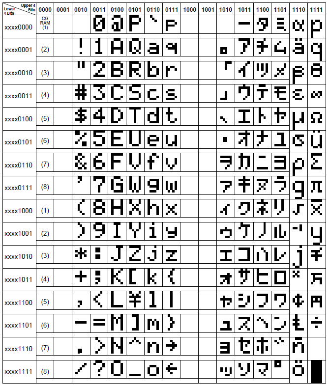

## Preparation tasks (done before the lab at home)

Use schematic of the [LCD keypad shield](../../Docs/arduino_shield.pdf) and find out the connection of LCD display. What data and control signals are used? What is the meaning of these signals?

&nbsp;

&nbsp;

&nbsp;

   | **LCD signal(s)** | **AVR pin(s)** | **Description** |
   | :-: | :-: | :-- |
   | RS | PB0 | Register selection signal. Selection between Instruction register (RS=0) and Data register (RS=1) |
   | R/W | GND  |Read/write Signal; 1→Read, 0→ Write|
   | E | PB1 | Enable; Falling edge |
   | D[3:0] | x | Bi-directional data bus, data transfer is performed once, thru DB0 to DB7, in the case of interface data length is 8-bits; and twice, through DB4 to DB7 in the case of interface data length is 4-bits. Upper four bits first then lower four bits. |
   | D[7:4] | PD[7:4] |  |

What is the ASCII table? What are the values for uppercase letters `A` to `Z`, lowercase letters `a` to `z`, and numbers `0` to `9` in this table?

&nbsp;

&nbsp;

&nbsp;
