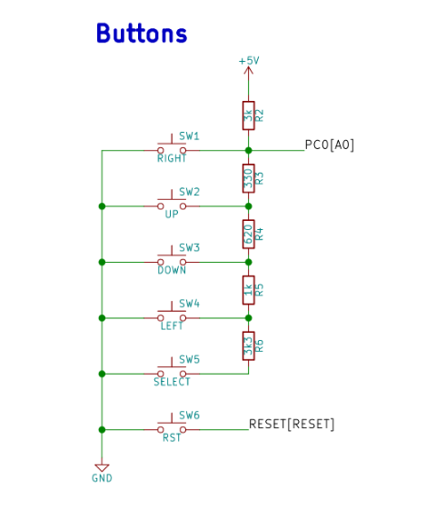
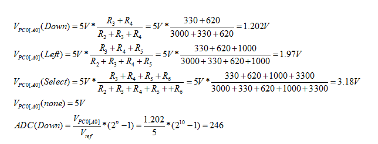

## Preparation tasks (done before the lab at home)

Use schematic of the [LCD keypad shield](../../Docs/arduino_shield.pdf) and find out the connection of five push buttons: Select, Left, Up, Down, and Right.

&nbsp;

&nbsp;

&nbsp;

According to the connection, calculate the voltage value on pin PC0[A0] if one button is pressed at a time. In this case, the voltage on the pin is given by the [voltage divider](https://www.allaboutcircuits.com/tools/voltage-divider-calculator/), where resistors R3, R4, R5 and R6 are applied successively.

&nbsp;

Calculate the ADC values for these voltages according to the following equation if reference is Vref=5V and number of bits for analog to digital conversion is n=10.

   | **Push button** | **PC0[A0] voltage** | **ADC value (calculated)** | **ADC value (measured)** |
   | :-: | :-: | :-: | :-: |
   | Right  | 0&nbsp;V | 0 |  |
   | Up     | 0.495&nbsp;V | 101 |  |
   | Down   |  1.202&nbsp;V| 246 |  |
   | Left   |  1.97&nbsp;V | 403 |  |
   | Select |  3.18&nbsp;V | 650 |  |
   | none   |  5&nbsp;V    | 1023|  |
   
   | **Operation** | **Register(s)** | **Bit(s)** | **Description** |
   | :-: | :-- | :-- | :-- |
   | Voltage reference | ADMUX | REFS1:0 | 01: AVcc voltage reference, 5V |
   | Input channel |  | MUX3:0 | 0000: ADC0, 0001: ADC1, ... |
   | ADC enable | ADCSRA |  |  |
   | Start conversion |  |  |  |
   | ADC interrupt enable |  |  |  |
   | ADC clock prescaler |  | ADPS2:0 | 000: Division factor 2, 001: 2, 010: 4, ...|
   | ADC result |  |  |  |
   
    | **Function name** | **Function parameters** | **Description** | **Example** |
   | :-- | :-- | :-- | :-- |
   | `uart_init` | `UART_BAUD_SELECT(9600, F_CPU)` | Initialize UART to 8N1 and set baudrate to 9600&nbsp;Bd | `uart_init(UART_BAUD_SELECT(9600, F_CPU));` |
   | `uart_getc` |  |  |
   | `uart_putc` |  |  |
   | `uart_puts` |  |  |
   

